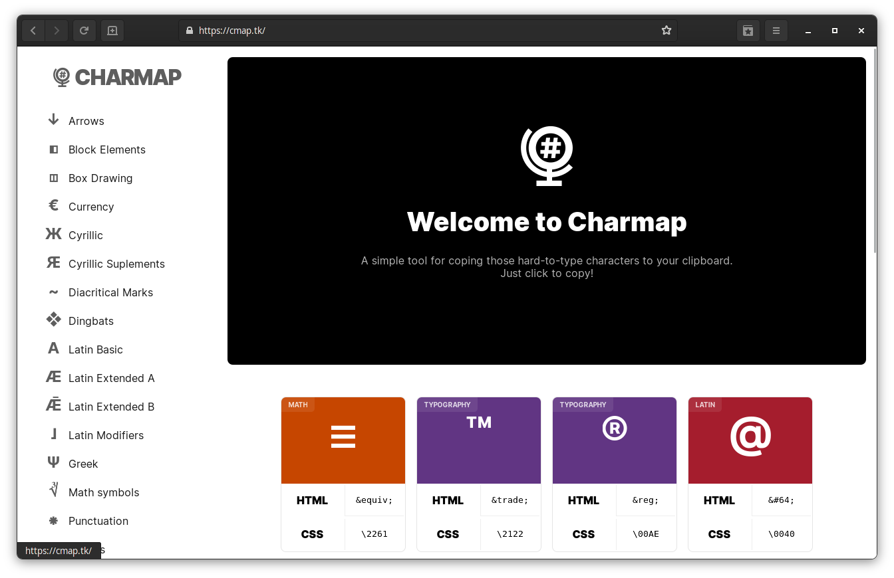

<h1 align="center">Character Map</h1>

_Charmap site screenshot_

---

This is a Character Map made with Next.js and Styled Components.
It allows you to copy characters and its charcodes. Just visit the [site](https://cmap.tk) and try it out!
